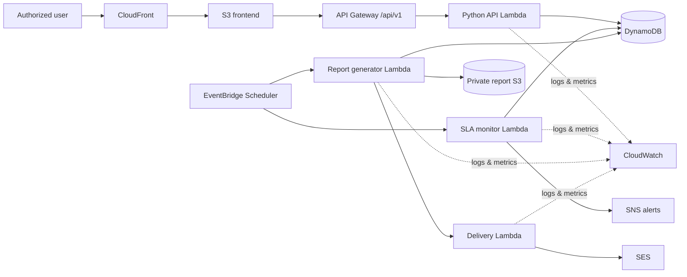

# ClaimOps Intelligence

ClaimOps Intelligence is a portfolio-grade, cloud-native insurance claims operations platform designed around the workflow **Monitor → Detect → Prioritize → Recommend → Act → Report**. It uses fictional data only and is intended to demonstrate serverless AWS architecture, operational analytics, auditable action management, and automated reporting.

> Status: Phase 10 complete — live, responsive SLA Control Tower with operational exposure details. AWS resources are not provisioned yet.

## Problem statement

Claims teams often have metrics spread across reports while urgent work remains hidden in queues. ClaimOps brings SLA exposure, bottlenecks, workload, document follow-up, explainable risk signals, QA, and reporting into one operations command center. Recommendations remain advisory; authorized users explicitly approve state-changing actions.

## Proposed architecture

The production design uses a static React/Vite application behind CloudFront, a versioned HTTP API on API Gateway and Python Lambda, and a DynamoDB on-demand operational store. EventBridge invokes SLA and report jobs. Reports are archived in a private encrypted S3 bucket and delivered through SES; SNS carries operational alerts. CloudWatch provides technical and business observability.



The API Lambda begins as a modular monolith to minimize cost and operational overhead. Domain services remain independent of AWS adapters so high-volume jobs can be split into separate Lambdas later. See [Architecture](docs/architecture/README.md), [data model](docs/data-model.md), [API boundaries](docs/api-boundaries.md), and [reporting architecture](docs/reporting.md).

## Planned features

- Executive operations overview and Action Center
- Claims search, inspection, assignment, escalation, follow-up, and audit history
- SLA Control Tower with transition-safe alerts
- Pipeline bottleneck and workload imbalance recommendations
- Explainable risk review, partner analytics, QA, aging, and rejection analysis
- Daily, weekly, monthly, and reusable custom reports
- PDF, CSV, and Excel exports, archive, subscriptions, and email delivery
- Business and technical monitoring

## Repository layout

```text
frontend/             React/Vite client (introduced in Phase 3)
backend/              Python domain, API, services, and repository ports
lambdas/              Thin AWS Lambda entry points
terraform/            Environment roots and reusable AWS modules
scripts/              Development and operational scripts
tests/                Unit, integration, and contract tests
docs/                 Architecture and interface decisions
.github/workflows/    CI/CD workflows (introduced in Phase 35)
```

Each empty implementation directory contains a `.gitkeep`; later phases replace these markers with code.

## AWS services and cost posture

The design uses API Gateway HTTP API, Lambda, DynamoDB on-demand, S3, CloudFront, EventBridge Scheduler, SNS, SES, IAM, and CloudWatch. There are no continuously running compute instances, NAT gateways, or provisioned database clusters. Log retention, report lifecycle rules, Lambda concurrency, DynamoDB point-in-time recovery, and AWS Budgets alerts will be configurable.

Cost depends on region and traffic. Before deployment, review a Terraform plan and current AWS pricing. Development environments should use short retention periods and conservative alarms. Teardown will be:

```bash
terraform -chdir=terraform/environments/dev destroy
```

No Terraform resources exist in Phase 1, so this command is documented for future phases and should not yet be run.

## Security model

- Least-privilege IAM per Lambda workload
- TLS in transit and AWS-managed encryption at rest by default
- Blocked public access for all S3 buckets; reports accessed through short-lived signed URLs
- API authorization with role-aware action checks (local mock auth only in development)
- Validated request schemas, conditional writes, audit events, and idempotency keys
- No credentials, secrets, real customer data, or PII in source control
- CloudWatch logs with controlled retention and no sensitive payload logging

## Observability

CloudWatch will track Lambda errors/duration, API latency and status codes, DynamoDB throttles, failed schedules, report delivery, and alarms. Domain metrics will cover SLA transitions, backlog, bottlenecks, report completion, and alert suppression. Correlation IDs link API requests, actions, and audit records.

## Local setup

Phase 1 has no runtime dependencies. To prepare local configuration:

```bash
cp .env.example .env
```

Python, Node, and Terraform setup commands will be added in the phases that introduce those toolchains.

Run the Phase 3 frontend shell:

```bash
cd frontend
npm install
npm run dev
```

Run the Phase 5 API from the repository root:

```bash
PYTHONPATH=backend uvicorn claimops.api.app:app --reload --port 8000
```

## Terraform deployment

Terraform is organized into small service-oriented modules under `terraform/modules` and an environment composition root under `terraform/environments/dev`. Backend state configuration, providers, resource definitions, validation, and deployment begin in Phase 34. Production resources must not be created manually.

## CI/CD

The planned GitHub Actions flow is: test → frontend build → Terraform format/validate/plan → approval-gated deployment. It will use GitHub OIDC to assume a narrowly scoped AWS role rather than long-lived AWS keys. Workflow implementation is reserved for Phase 35.

## Testing

Tests will be separated into unit, integration, and API contract suites. Coverage will include SLA boundaries, missing deadlines and owners, risk explanations, KPI/report zero-data cases, idempotent scheduled invocations, delivery failures, and invalid state transitions. Phase 1 validation checks structure and documentation only.

## Synthetic-data disclaimer

All future claims, people, partners, facilities, products, identifiers, and events in this repository will be generated and fictional. They must not be interpreted as real customers, claims, fraud findings, underwriting rules, or company performance.

Generate the reproducible 2,000-claim baseline with:

```bash
python3 scripts/generate_claims.py
```

The generated file is deliberately Git-ignored. See [Synthetic claims dataset](docs/synthetic-data.md) for fields, designed variation, CSV output, and reproducibility controls.

## Phase 1 validation

From the repository root:

```bash
test -f README.md && test -f docs/data-model.md && test -f docs/api-boundaries.md
test -f docs/reporting.md && test -f terraform/README.md
find . -path './.git' -prune -o -type f -print | sort
git rev-parse --is-inside-work-tree >/dev/null 2>&1 && git status --short || echo "Git metadata is not initialized"
```

Confirm that documentation renders the Mermaid diagrams on GitHub, `.env` is ignored after copying it, and no runtime code, generated claims, Terraform resources, or credentials are present. This workspace currently contains an empty `.git` placeholder rather than initialized Git metadata; initialize Git separately if version control has not been set up by your environment.

## Roadmap

Development follows the 40 gated phases in the project brief. The next phase, only after explicit approval, is **Phase 11 — Claims Pipeline**.

## Future improvements

Potential post-roadmap enhancements include Cognito/enterprise identity federation, Slack or Teams notification adapters, Step Functions for complex reporting orchestration, accessibility audits, disaster-recovery exercises, and configurable tenant isolation.
