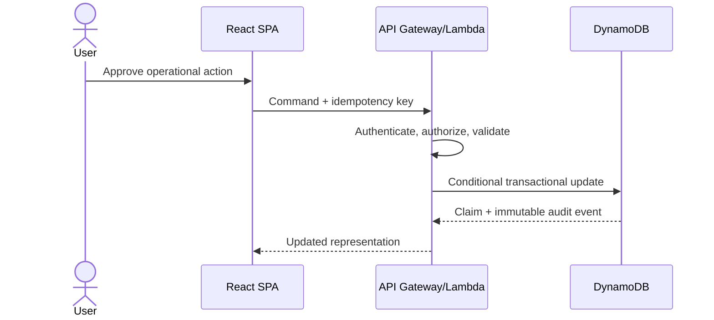

# Architecture

## Objectives and constraints

ClaimOps favors managed, event-driven AWS services and a modular-monolith API. This keeps a portfolio environment inexpensive while preserving seams for independent scaling. All timestamps are stored as UTC ISO-8601 values; schedules carry an explicit IANA timezone. All mutable operations are authorized, validated, conditionally written, and audited.

## Runtime components

| Component | Responsibility | Data access |
|---|---|---|
| React/Vite SPA | Operational views, filters, action workflows | Versioned API only |
| API Lambda | Queries, commands, authorization, validation | DynamoDB, signed S3 URLs |
| SLA monitor | Recalculate open-claim SLA state and emit transitions | DynamoDB, SNS |
| Report generator | Aggregate KPIs, insights, and export artifacts | DynamoDB, S3 |
| Report delivery | Send archived report links/attachments | DynamoDB, S3, SES |
| EventBridge Scheduler | Timezone-aware SLA and report triggers | Lambda invoke only |

## Request and action flow

State changes use DynamoDB transactions so the claim and audit record commit together. Optimistic version numbers reject stale edits. Request idempotency records make retries safe.

## Availability and failure handling

- API operations are stateless and retry only safe reads or idempotent writes.
- Scheduled jobs use invocation IDs and state-transition conditions to suppress duplicates.
- Failed asynchronous invocations go to a dead-letter destination and raise an alarm.
- Reports are generated before metadata is marked `COMPLETED`; partial artifacts are not exposed.
- S3 lifecycle rules expire nonessential development artifacts; production retention is explicit.

## Environments

Phase 34 will compose reusable modules into isolated environment roots. Resource names and tags include application, environment, owner, and managed-by metadata. Remote encrypted state and locking will be configured before shared deployment.

## Architectural decisions

1. Use one operational DynamoDB table to support transactional claim/action/audit access and avoid idle database cost.
2. Keep immutable report artifacts in S3 and searchable metadata in DynamoDB.
3. Use synchronous APIs for user commands and asynchronous schedules for monitoring/reporting.
4. Keep recommendations advisory; only authorized commands mutate assignment or status.
5. Separate domain logic from AWS repository and notification adapters for local testing.

