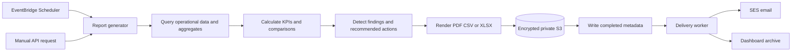

# Reporting architecture

## Flow

## Lifecycle

1. A manual request or timezone-aware EventBridge schedule creates a run with a unique invocation ID.
2. A conditional write prevents duplicate generation for the definition and reporting period.
3. The generator queries bounded periods, calculates KPIs, comparisons, findings, and actionable recommendations.
4. Format renderers produce artifacts and checksums; S3 stores them with encryption, public access blocked, and lifecycle policy.
5. Metadata changes from `PENDING` to `COMPLETED` only after a valid artifact exists.
6. Delivery loads the completed artifact, sends through SES, and records each attempt. Failures remain retryable and alarmed.

## Report contracts

Definitions store report type, metrics, dimensions, filters, timezone, cadence, next run, formats, delivery channels, and enabled state. Runs store the resolved period, definition version, status, KPI snapshot, findings, artifact metadata, delivery status, and error category—never raw email credentials.

Daily, weekly, and monthly periods are closed intervals derived in the definition timezone and converted to UTC for queries. Empty periods produce a valid zero-claims report. Daily reports prioritize “Action Required Today”; weekly and monthly reports add prior-period comparisons and management recommendations.

## Reliability and security

- Idempotency is based on definition, period, format, and definition version.
- S3 object keys are non-public and do not contain recipient addresses.
- Downloads use short-lived signed URLs issued after authorization.
- SES identities are configured outside application data; delivery results are audited.
- Generation and delivery have separate retry policies and alarms.
- CloudWatch emits duration, generated/failed count, data freshness, and delivery failure metrics.

